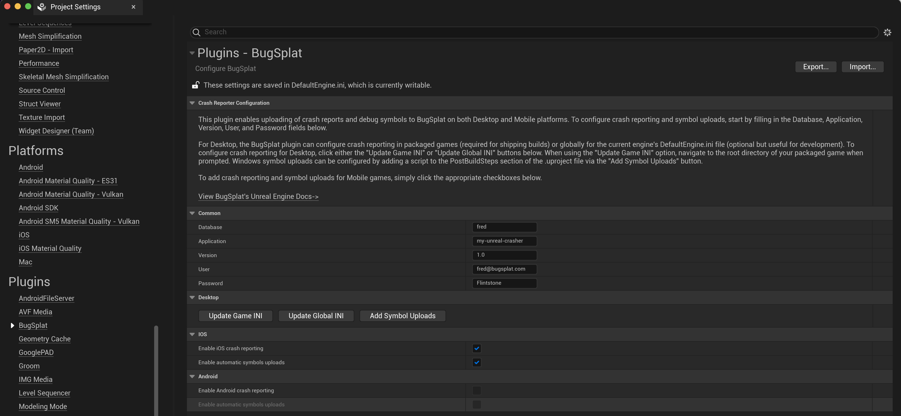
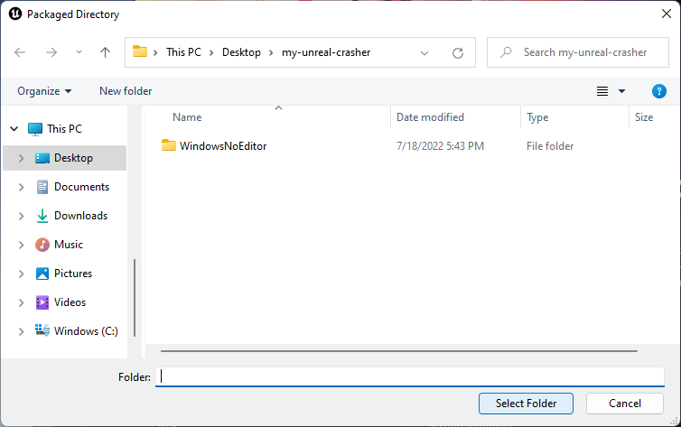
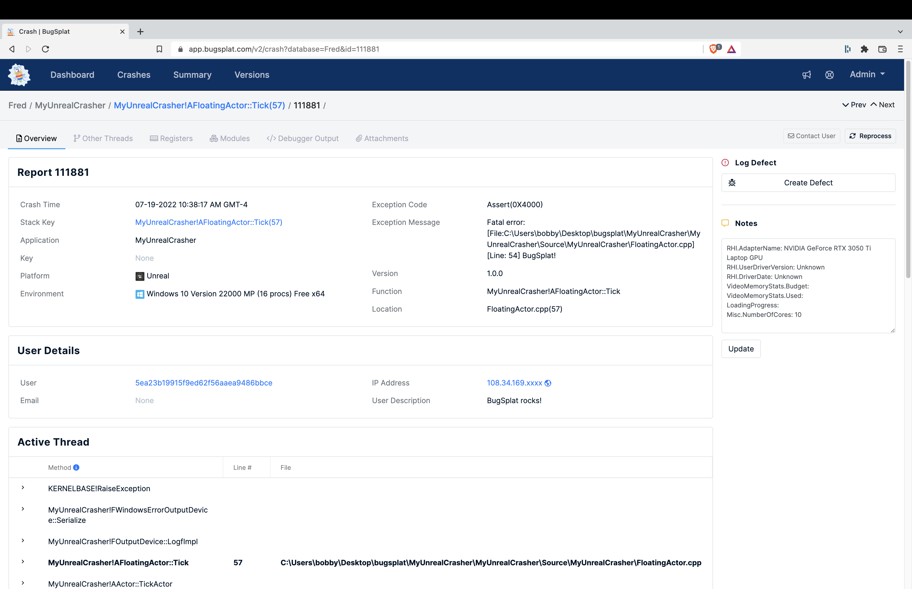

[](https://bugsplat.com)
<br/>
# <div align="center">BugSplat</div> 
### **<div align="center">Crash and error reporting built for busy developers.</div>**
<div align="center">
    <a href="https://twitter.com/BugSplatCo">
        
    </a>
    <a href="https://discord.gg/K4KjjRV5ve">
        
    </a>
</div>
<br>

## 👋 Introduction

BugSplat's Unreal Editor plugin makes adding crash reporting to your game a breeze! With [BugSplat](https://bugsplat.com), you'll get a crash notification containing a full call stack with function names, line numbers, as well as many other invaluable insights into the issues tripping up your users.

Before diving into the plugin, please complete the following tasks:

* [Sign Up](https://app.bugsplat.com/v2/sign-up) as a new BugSplat user
* Complete the [Welcome](https://app.bugsplat.com/v2/welcome) workflow and make a note of your BugSplat database
* Review our [MyUnrealCrasher](https://github.com/BugSplat-Git/my-unreal-crasher) sample application to jump-start your evaluation of BugSplat

## 🏗 Installation 

You may choose to add BugSplat to your Unreal Project manually, or through the Unreal Marketplace.

### Install manually

1. Navigate to your project folder, which contains your `[ProjectName].uproject` file.
2. If it does not already exist, create a `Plugins` folder.
3. Create a `BugSplat` folder in the `Plugins` folder and copy the contents of this repo into the `BugSplat` folder.
4. In the Unreal Editor, ensure you can access the BugSplat plugin via `Edit > BugSplat`.

### Install from MarketPlace

Coming soon 🙂

## ⚙️ Configuration

BugSplat's Unreal plugin currently supports adding crash reporting to Windows, macOS, Linux, and iOS games. With a few clicks, the BugSplat plugin can be configured to automatically upload symbol files so crash report stack traces display function names and line numbers. Support for Android is coming soon!

To get started, access the BugSplat plugin menu in the Unreal Editor via `Edit > Project Settings`. Scroll to the `BugSplat` section of `Project Settings` and add values for `Database`, `Application`,  `Version`, `User`, and `Password`:



### Desktop

For Desktop, the BugSplat plugin has the ability to modify the [DefaultEngine.ini](https://docs.unrealengine.com/5.0/en-US/configuration-files-in-unreal-engine/) file for both a packaged build or the global engine so that crashes are posted to BugSplat. Additionally, the BugSplat plugin can add a [PostBuildStep](https://docs.unrealengine.com/5.0/en-US/unreal-engine-build-tool-target-reference/) that will upload Windows [symbol files](https://docs.bugsplat.com/introduction/development/working-with-symbol-files) to BugSplat after each build.

BugSplat recommends configuring the crash reporting independently for each packaged build. To configure crash reporting in a packaged build select `Update Game INI`. When prompted, navigate to the root directory of your packaged build that contains the folder `Windows` or `WindowsNoEditor`. Note that you will need to **repeat this step and update the version information every time you create a packaged version of your game**. For production scenarios consider automating this step with a script on your build machine.



Alternatively, BugSplat can be configured to collect crash reports in the editor and all games built with the current engine. To configure BugSplat for the current engine, select `Update Global INI`. Note that updating the global `DefaultEngine.ini` file **will affect all projects using the same engine build**.

In order to get function names and line numbers in crash reports you'll need to upload your game's `.exe`, `.dll`, and `.pdb` files. To upload symbol files to BugSplat, select the `Add Symbol Uploads` button. The `Add Symbol Uploads` button will generate a bash script which uploads your project's [symbol files](https://docs.bugsplat.com/introduction/development/working-with-symbol-files) to BugSplat. A script to execute [SendPdbs.exe](https://docs.bugsplat.com/education/faq/using-sendpdbs-to-automatically-upload-symbol-files) will be added to the `PostBuildSteps` field in `BugSplat.uplugin` and will run automatically when your game is built.

### Mobile

Installing the BugSplat plugin will configure crash reporting and symbol uploads automatically on mobile platforms.

Before attempting to use the BugSplat plugin to capture crashes on Mobile please ensure you've completed the [iOS](https://docs.unrealengine.com/5.0/en-US/setting-up-an-unreal-engine-project-for-ios/) and [Android](https://docs.unrealengine.com/5.0/en-US/android-support-for-unreal-engine/) quickstart guides.

In order to get function names and line numbers in your iOS crash reports, please make the following changes in the `iOS` section of `Project Settings`

| Option | Value |
|--------|-------|
| Generate dSYMs for code debugging and profiling| true |
| Generate dSYMs as a bundle for third party crash tools | true |
| Support bitcode in shipping | false |

Additionally, have found that sometimes iOS applications won't crash while the USB cable is connected. If this happens, disconnect the USB cable and re-run the application to trigger a crash.

## 🏃 Usage

Once you've installed the plugin, add the following C++ snippet to your game to generate a sample crash.

```cpp
UE_LOG(LogTemp, Fatal, TEXT("BugSplat!"));
```

Run your application and submit a crash report.

On Desktops, submit a crash report via the Unreal CrashReportClient dialog that appears at crash time. We have developed a handy guide on how you can customize the Unreal CrashReportClient dialog that is available [here](https://www.bugsplat.com/blog/game-dev/customizing-unreal-engine-crash-dialog/). 

On iOS, after a crash occurs, restart the game and tap the `Send Report` option when prompted.

Once you've submitted a crash report navigate to the [Crashes](https://app.bugsplat.com/v2/crashes) page. On the Crashes page, click the link in the ID column.

If everything is configured correctly, you should see something that resembles the following:



## 🧑‍💻 Contributing

BugSplat ❤️s open source! If you feel that this package can be improved, please open an [Issue](https://github.com/BugSplat-Git/bugsplat-unreal/issues). If you have an awesome new feature you'd like to implement, we'd love to merge your [Pull Request](https://github.com/BugSplat-Git/bugsplat-unreal/pulls). You can also send us an [email](mailto:support@bugsplat.com), join us on [Discord](https://discord.gg/K4KjjRV5ve), or message us via the in-app chat on [bugsplat.com](https://bugsplat.com).
