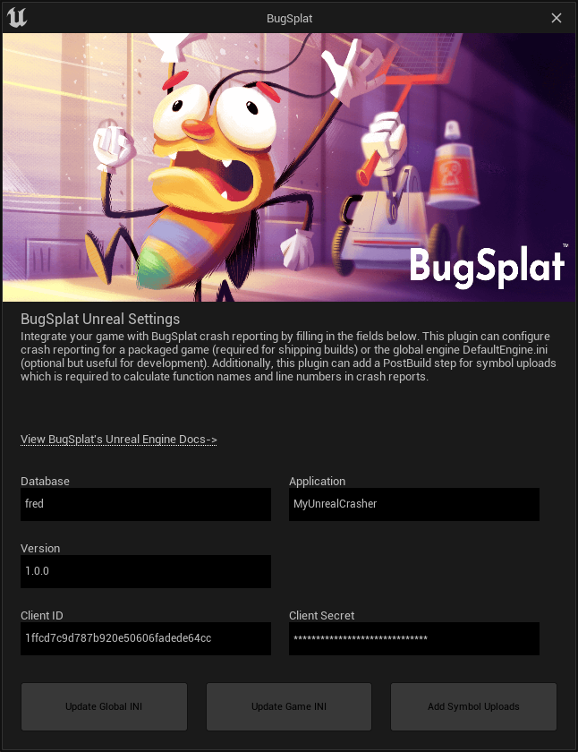

[](https://bugsplat.com)
<br/>
# <div align="center">BugSplat</div> 
### **<div align="center">Crash and error reporting built for busy developers.</div>**
<div align="center">
    <a href="https://twitter.com/BugSplatCo">
        
    </a>
    <a href="https://discord.gg/K4KjjRV5ve">
        
    </a>
</div>
<br>

> ℹ️ This plugin is useful for evaluating BugSplat. For shipping games, we recommend you use a script in your build pipeline for symbol uploads and incrementing the version portion of the DataRouterUrl field in `DefaultEngine.ini` in your packaged game.

<br>

## 👋 Introduction

BugSplat's Unreal Editor plugin makes adding crash reporting to your game a breeze! With [BugSplat](https://bugsplat.com), you'll get a crash notification containing a full call stack with function names, line numbers, as well as many other invaluable insights into the issues tripping up your users.

Before diving into the plugin, please complete the following tasks:

* [Sign Up](https://app.bugsplat.com/v2/sign-up) as a new BugSplat user
* Complete the [Welcome](https://app.bugsplat.com/v2/welcome) workflow and make a note of your BugSplat database
* Review our [MyUnrealCrasher](https://github.com/BugSplat-Git/my-unreal-crasher) sample application to jump-start your evaluation of BugSplat

## 🏗 Installation 

You may choose to add BugSplat to your Unreal Project manually, or through the Unreal Marketplace.

### Install manually

1. Navigate to your project folder, which contains your `[ProjectName].uproject` file.
2. If it does not already exist, create a `Plugins` folder.
3. Create a `BugSplat` folder in the `Plugins` folder and copy the contents of this repo into the `BugSplat` folder.
4. In the Unreal Editor, ensure you can access the BugSplat plugin via `Edit > BugSplat`.

### Install from MarketPlace

Coming soon 🙂

## ⚙️ Usage

BugSplat's Unreal plugin currently supports adding crash reporting to Windows games. Support for additional platforms is in development and will be available soon!

### Windows

For Windows, the BugSplat plugin has the ability to modify both the global engine, and packaged build versions of [DefaultEngine.ini](https://docs.unrealengine.com/5.0/en-US/configuration-files-in-unreal-engine/) so that crashes are posted to BugSplat. Additionally, the BugSplat plugin can add a [PostBuildStep](https://docs.unrealengine.com/5.0/en-US/unreal-engine-build-tool-target-reference/) that will upload [symbol files](https://docs.bugsplat.com/introduction/development/working-with-symbol-files) to BugSplat after each build.

To get started, access the BugSplat plugin menu in the Unreal Editor via `Edit > BugSplat`.

Add values for `Database`, `Application`,  `Version`, `Client ID`, and `Client Secret`. Note that a `Client ID` and `Client Secret` are generated on the [Integrations](https://app.bugsplat.com/v2/settings/database/integrations) page.



Once you are happy with your configuration settings, you can choose which `DefaultEngine.ini` to update depending on your build process and preferences.

If you would like BugSplat to be configured for every new packaged build, select `Update Global Ini`. Note that updating the global `DefaultEngine.ini` file **will affect all projects* using the same engine build. The advantage of this approach is will only need to be repeated when your configuration settings change, but does not need to be repeated every build.

If you would like to add BugSplat to a packaged build, select `Update Game Ini`. When prompted, navigate to the root directory of your packaged build that contains the folder `Windows` or `WindowsNoEditor`. Note that you will need to **repeat this step every time you create a packaged version of your game**.


If you would like BugSplat to automatically upload symbol files during package time, select `Add Symbol Uploads`. This will generate a bash script which uploads your project's [symbol files](https://docs.bugsplat.com/introduction/development/working-with-symbol-files) to BugSplat. Symbol files are needed to get function names and line numbers in crash reports. A script to execute [SendPdbs.exe](https://docs.bugsplat.com/education/faq/using-sendpdbs-to-automatically-upload-symbol-files) will be added to the `PostBuildSteps` field in `BugSplat.uplugin` and will run automatically when your game is built.

Once you've installed the plugin, execute a snippet of C++ that will generate a crash.

```cpp
UE_LOG(LogTemp, Fatal, TEXT("BugSplat!"));
```

Submit the crash report and navigate to the [Crashes](https://app.bugsplat.com/v2/crashes) page. On the Crashes page, click the link in the ID column.

If everything is configured correctly, you should see something that resembles the following:


## 🧑‍💻 Contributing

BugSplat ❤️s open source! If you feel that this package can be improved, please open an [Issue](https://github.com/BugSplat-Git/bugsplat-unreal/issues). If you have an awesome new feature you'd like to implement, we'd love to merge your [Pull Request](https://github.com/BugSplat-Git/bugsplat-unreal/pulls). You can also send us an [email](mailto:support@bugsplat.com), join us on [Discord](https://discord.gg/K4KjjRV5ve), or message us via the in-app chat on [bugsplat.com](https://bugsplat.com).
